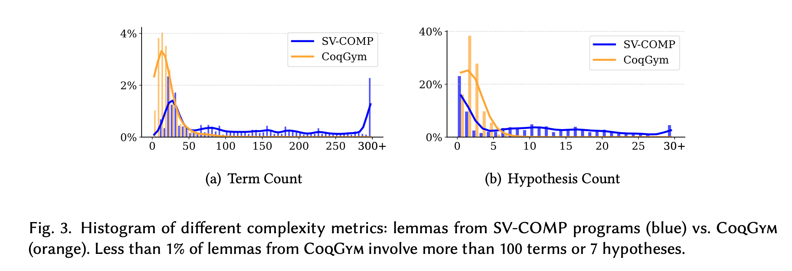

# AutoRocq-bench: Theorem Proving Benchmark for Program Verification

[](https://www.gnu.org/licenses/gpl-3.0.en.html) 
[](https://arxiv.org/abs/2511.17330)
 [](https://discord.gg/HfS2zcMzhS)

AutoRocq-bench is a corpus of Rocq/Coq proof obligations extracted from real C code, intended for evaluating interactive or automated theorem proving workflows.

---

## What Is In This Repository

The benchmark targets **Rocq (formerly Coq) 8.18.0** and contains obligations derived from:

- **SV-COMP programs** (`svcomp`)
- **Linux-kernel modules** (`verker`)

The benmark theorems are generated with the weakest precondition (`wp`) plugin of [Frama-C](https://frama-c.com).

At a high level, each benchmark entry consists of 
1. a `.v` file (with a *single* unproved theorem `wp_goal`), and 
2. an associated entry in `report.json` that points to its origin in the source code in `source_programs/`.

#### Sturcture:

- `benchmarks/`
  - `svcomp/`: Benchmark directories.
  - `verker/`: Benchmark directories.
  - `svcomp-ablation.txt`: list of 70 sampled goals from `svcomp/`.
  - `svcomp-ablation.txt`: list of 571 remaining goals from `svcomp/`.
  - `verker-assert.txt`: list of 60 assertion goals from `verker/`.
  - `complexity-*.csv`: complexity metrics of subject goals, by counting different aspects of the goal statement.
- `source_programs/`
  - `svcomp/`: original C source files for `benchmarks/svcomp`.
  - `verker/`: original C headers/sources for `benchmarks/verker`.
- `libautorocq/`
  - Library for compiling Coq benchmark files.

## Why Is It Important

Proof obligations extracted from even simple programs can be verbose and complicated. Existing benchmarks on math theorems with human-written ground truths rarely capture this intricacy.
For example, compared to mathematical theorems from [CoqGym](https://github.com/princeton-vl/CoqGym), on which most existing approaches are trained and evluated, these program-derived goals tend to feature much higher *complexity*:




## Citation / Attribution

If you are interested in the work, consider joining the [Discord](https://discord.gg/HfS2zcMzhS) server for the latest discussions/development of agentic program verification!

If you use our work for academic research, please cite our paper:

```
@article{autorocq,
  title={Agentic Verification of Software Systems},
  author={Tu, Haoxin and Zhao, Huan and Song, Yahui and Zafar, Mehtab and Meng, Ruijie and Roychoudhury, Abhik},
  journal={Proceedings of the ACM on Software Engineering},
  volume={1},
  number={FSE},
  year={2026},
  publisher={ACM New York, NY, USA}
}
```


